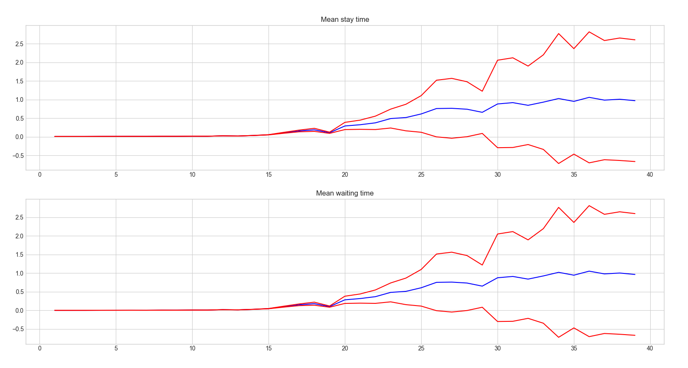
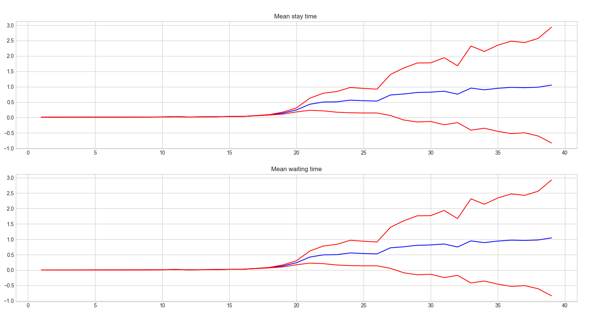
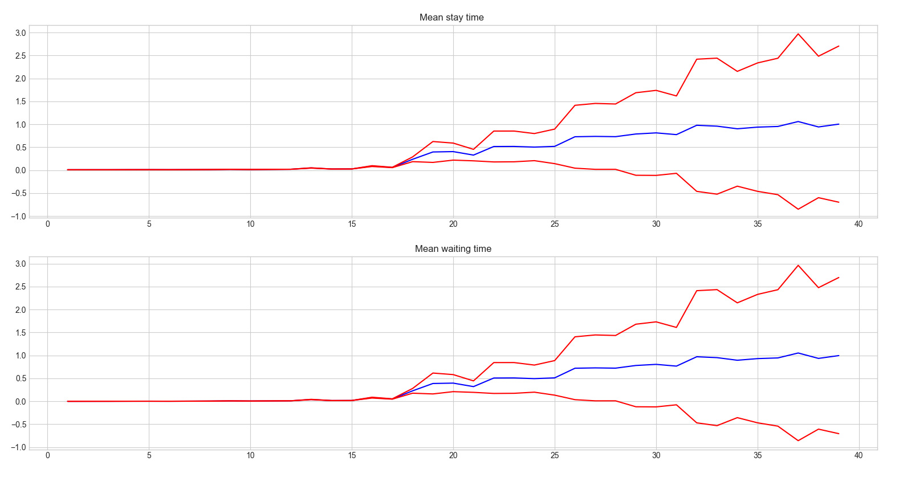
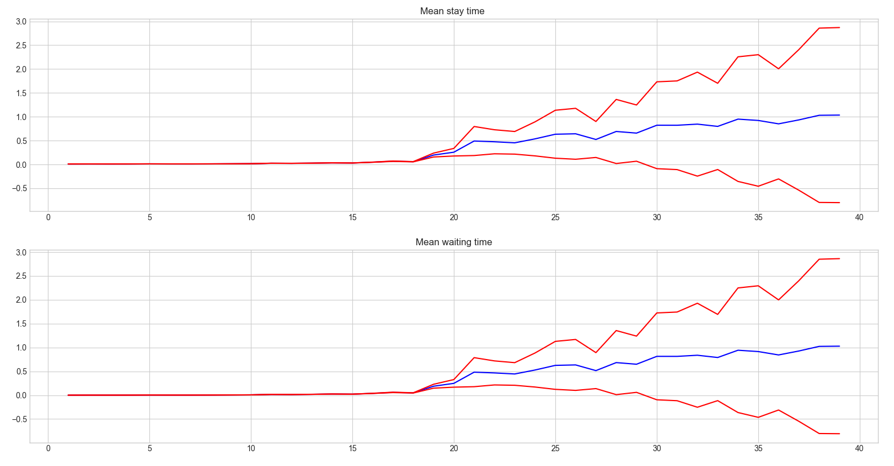
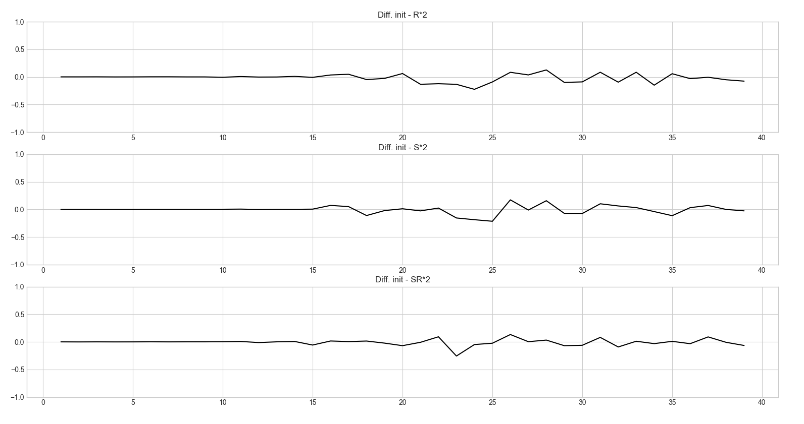
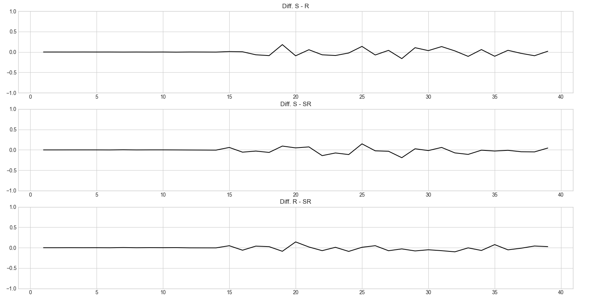

# Mini Projet SED


## Partie 1

* Tache 1 

Pour récuperer le temps moyen de séjour il nous suffit de d'addition le temps se séjour de chaque client (ie : temps départ - temps arrivé) puis de diviser par le nombre totale de client, ce qui donne en python : :

```py
sum([r.exit_date - r.arrival_date for r in record])/len(records)
```

Pour le temps moyen d'attente la solution est assez similaire , on utilise l'attribut `waiting time ` pour chaque client en les additionnant et en divisant par le nombre totale de client 

```py
sum([r.waiting_time for r in records])/len(records)
```


* Tache 2 : 
Pour la méthode de réplication, indiquer le nombre de réplications (répétitions) et la
précision que vous décidez d’utiliser

Pour notre méthode, on va réaliser 40 répétitions, les 10 premières vont correspondre au temps de réchauffement, puis le reste à 30 vrais essais qui servirons pour nos statistiques de performance. On génère à chaque fois des données avec une seed différentes
On va prendre un $\alpha = 95$ pour avoir une bonne précision  

A chaque réplication, nous avons la même configuration initiale mais cela va nous généré des nombres aléatoire différents. 

* Tache 3 : 

## Partie 2 

## Tache 1 

On utilise la méthode par réplication

Dans le code source

## Tache 2 


{height:200px}


On remarque que les deux courbes sont très similaires, ce qui correspond aux prints de test que nous avions effectués qui étaient à chaque fois très proche ! 


 
## Partie 3

### Tache 1   










### Tache 2 


Les différences sont très minimes même si il semble que double la vitesse du serveur ou la bande passante semble plus efficace ( la courbe est plus souvent dans le positif cela veut dire que l'on attend moins lontemps et que les clients sont traités plus rapidement par la simulation que dans l'état initiale )

\pagebreak
### Tache 3 



### Tache 4 
Le plus efficace selon nous est de doubler la vitesse du serveur, en effet la différence de S et de R reste souvent dans le positif donc c'est la solution la plus efficace car cela veut dire comme précedemment que les clients sont traités plus rapidement si on double la vitese du serveur  

Doubler le nombre de serveur sur SR semble la solution la moins efficace car quelque soit la différence avec SR la courbe va dans le négatif ce qui signifie que les clients sont traités plus lentement que si l'on double la vitesse du serveur ou la bande passante. 

Si l'on doit classer les solution par ordre d'efficacité nous dirions : 

1. Doubler la vitesse du server
2. Double la bande passante
3. Doubler le nombre de serveur 